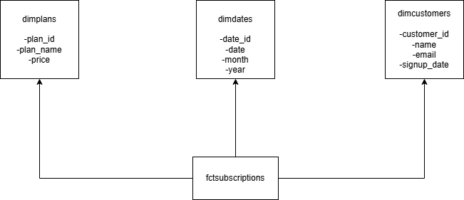

# SaaS Analytics Portfolio

Analytics engineering projects built with dbt, Streamlit, Python, and SQL.

## Projects

| Project | Description | Tools |
|---------|-------------|-------|
| dbt Pipeline | Conversion analytics pipeline with staging, intermediate, and mart models. Includes data quality tests. | dbt, DuckDB, SQL |
| Conversion Dashboard | Interactive dashboard tracking user conversion and churn metrics. | Streamlit, Python |
| Retention Analysis | Cohort retention and churn analysis for subscription businesses. | Python, Pandas, Colab |
| Lead Scraper | Automated business lead generation from public directories. | Python, BeautifulSoup |
| Data Model | Star schema design for SaaS subscription analytics. | Draw.io |

## Data Model

## Live Dashboard

[View Dashboard](https://saasconversions-drux8gj4lcnpkq5v95qjwj.streamlit.app/)
